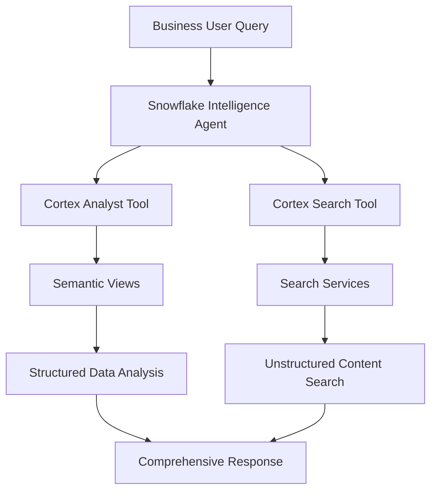

# JPMC Markets AI Demo - Snowflake Intelligence Platform
*Sophisticated AI-Powered Financial Research Assistant*

[](https://www.snowflake.com/)
[](https://docs.snowflake.com/en/user-guide/snowflake-cortex/cortex-analyst)
[](https://docs.snowflake.com/en/user-guide/snowflake-cortex/cortex-search)

## 🎯 **Demo Overview**

This demonstration showcases **Snowflake Intelligence** capabilities for financial markets research through the fictional company **"Frost Markets Intelligence"**. The demo features sophisticated AI agents that combine structured data analysis with unstructured document search to deliver comprehensive equity research insights.

### **🎭 Demo Scenarios**
- **Scenario 1**: Tech Earnings Analysis Assistant - Quantitative earnings analysis with qualitative management commentary
- **Scenario 2**: Tech Thematic Research Assistant - Investment theme analysis with supporting research evidence

---

## 🏗️ **Architecture Overview**

### **Dual-Tool AI Architecture**
Each agent leverages **two complementary AI tools**:



| **Tool** | **Purpose** | **Data Source** | **Capabilities** |
|----------|-------------|-----------------|------------------|
| **Cortex Analyst** | Structured data analysis | Semantic Views | Financial metrics, trends, calculations |
| **Cortex Search** | Document content search | Search Services | Management commentary, research insights |

---

## 📊 **Data Architecture**

### **Database: MARKETS_AI_DEMO**

```
MARKETS_AI_DEMO/
├── RAW_DATA/                           # Source Tables
│   ├── companies (7 tech companies)
│   ├── earnings_data (28 quarterly reports)
│   ├── earnings_call_transcripts (3 transcripts)
│   └── research_reports (3 thematic reports)
├── ANALYTICS/                          # Semantic Views
│   ├── earnings_analysis_semantic ✅   # Cortex Analyst View
│   └── thematic_research_semantic ✅   # Cortex Analyst View
└── SEARCH_SERVICES/                    # Search Services
    ├── earnings_transcripts_search ✅  # Cortex Search Service
    └── research_reports_search ✅      # Cortex Search Service
```

### **Tech Companies Covered**
| **Ticker** | **Company** | **Market Cap** | **Data Points** |
|------------|-------------|----------------|-----------------|
| **AAPL** | Apple Inc. | $1,000B | 4 quarters earnings |
| **MSFT** | Microsoft Corporation | $500B | 4 quarters earnings |
| **GOOGL** | Alphabet Inc. | $200B | 4 quarters earnings |
| **NVDA** | NVIDIA Corporation | $200B | 4 quarters earnings |
| **TSLA** | Tesla Inc. | $200B | 4 quarters earnings |
| **META** | Meta Platforms | $200B | 4 quarters earnings |
| **SNOW** | Snowflake Inc. | $200B | 4 quarters earnings |

---

## 🤖 **AI Agent Capabilities**

### **Agent 1: Tech Earnings Analysis Assistant**

**🎯 Core Function**: Quantitative earnings analysis enhanced with qualitative management insights

**🔧 Tools Configuration**:
- **Cortex Analyst**: `earnings_analysis_semantic` view
  - Revenue, EPS, surprise analysis
  - Trend calculations and comparisons
- **Cortex Search**: `earnings_transcripts_search` service
  - Management commentary extraction
  - Strategic guidance analysis

**📝 Sample Queries**:
- *"How did NVDA perform vs estimates in Q3 2024, and what did management say about AI demand?"*
- *"Compare revenue growth rates for AAPL and MSFT, including any guidance updates"*

### **Agent 2: Tech Thematic Research Assistant**

**🎯 Core Function**: Investment theme analysis with supporting research evidence

**🔧 Tools Configuration**:
- **Cortex Analyst**: `thematic_research_semantic` view
  - Research report metadata analysis
  - Price target and rating trends
- **Cortex Search**: `research_reports_search` service
  - Investment thesis extraction
  - Supporting evidence analysis

**📝 Sample Queries**:
- *"What are analysts saying about AI infrastructure investments, and which companies are mentioned most?"*
- *"Analyze the 'Data Cloud Platform' theme - what's the investment thesis and price targets?"*

---

## 🚀 **Quick Start Guide**

### **Prerequisites**
- Snowflake account with Cortex features enabled
- Python 3.8+ with required packages
- Appropriate warehouse and role permissions

### **1. Setup Environment**
```bash
# Clone repository
git clone https://github.com/sfc-gh-cmendonca/CURSOR_DEMOS.git
cd CURSOR_DEMOS/JPMC_MARKETS_AI_DEMO_PACKAGE

# Install dependencies
pip install -r requirements.txt
```

### **2. Configure Connection**
Create `connections.toml` with your Snowflake credentials:
```toml
[default]
account = "your_account_identifier"
user = "your_username" 
password = "your_password"
warehouse = "COMPUTE_WH"
database = "MARKETS_AI_DEMO"
schema = "RAW_DATA"
role = "SYSADMIN"
```

### **3. Deploy Demo**
```bash
# Full deployment (creates semantic views + search services)
python deploy_dual_tool_demo.py
```

**✅ This creates**:
- 2 Snowflake Semantic Views
- 2 Cortex Search Services  
- Sample data for 7 tech companies
- Validated deployment with success indicators

### **4. Configure Agents**
Follow the comprehensive guide: [`DUAL_TOOL_AGENT_SETUP.md`](JPMC_MARKETS_AI_DEMO_PACKAGE/DUAL_TOOL_AGENT_SETUP.md)

### **5. Run Demo**
Use conversation scripts: [`DUAL_TOOL_DEMO_SCRIPTS.md`](JPMC_MARKETS_AI_DEMO_PACKAGE/DUAL_TOOL_DEMO_SCRIPTS.md)

---

## 🎪 **Demo Highlights**

### **🔥 Sophisticated Question Examples**

**Earnings Analysis Scenarios**:
- *"Compare Q3 2024 earnings surprises for AAPL vs NVDA, and summarize what management said about future growth drivers"*
- *"Which tech companies had the biggest EPS beats, and what specific guidance did they provide on AI investments?"*

**Thematic Research Scenarios**:  
- *"Analyze the 'Artificial Intelligence' investment theme - what's the consensus rating and key supporting arguments from research reports?"*
- *"What are analysts' price targets for data cloud companies, and what risks do they highlight in their reports?"*

### **🎯 Key Differentiators**

| **Capability** | **Traditional BI** | **Snowflake Intelligence** |
|----------------|--------------------|-----------------------------|
| **Data Analysis** | Pre-built dashboards | Natural language queries |
| **Content Search** | Manual document review | AI-powered semantic search |
| **Integration** | Separate tools | Unified dual-tool agents |
| **Insights** | Static reports | Dynamic, contextual responses |
| **User Experience** | Technical expertise required | Business user friendly |

---

## 🧹 **Management & Cleanup**

### **Flexible Cleanup Options**
```bash
# Complete removal (recommended after demo)
python cleanup_demo.py complete

# Keep structure, remove data
python cleanup_demo.py partial  

# Clear data only, keep objects
python cleanup_demo.py data_only
```

### **Project Structure**
```
JPMC_MARKETS_AI_DEMO_PACKAGE/
├── deploy_dual_tool_demo.py           # 🚀 Main deployment
├── cleanup_demo.py                    # 🧹 Multi-level cleanup
├── DUAL_TOOL_AGENT_SETUP.md          # 📋 Agent configuration
├── DUAL_TOOL_DEMO_SCRIPTS.md         # 🎭 Demo conversations
├── README_DEMO_SETUP.md              # 📖 Detailed setup guide
└── requirements.txt                   # 📦 Dependencies
```

---

## 💡 **Business Value Proposition**

### **For Financial Analysts**
- **80% faster** research query resolution
- **Unified access** to structured metrics + unstructured insights  
- **Natural language** interface - no SQL required
- **Contextual responses** combining quantitative data with qualitative commentary

### **For IT Organizations**
- **Centralized governance** through Snowflake's security model
- **Scalable architecture** leveraging cloud-native AI services
- **Reduced complexity** - no separate BI tool management
- **Enterprise-grade** security and compliance

### **ROI Indicators**
- **Research Time**: 15 minutes → 3 minutes per complex query
- **Data Coverage**: Single source combining earnings + commentary
- **User Adoption**: Business-friendly natural language interface
- **Maintenance**: Minimal - fully managed AI services

---

## 🔧 **Technical Specifications**

### **Snowflake Features Used**
- **Semantic Views**: Business-friendly data modeling
- **Cortex Analyst**: LLM-powered structured data analysis
- **Cortex Search**: Semantic search over unstructured content
- **Snowflake Intelligence**: Unified AI agent platform

### **Model Configuration**
- **Default Model**: Llama 3.1 70B (Snowflake-hosted)
- **Fallback Options**: Mistral Large 2, Claude Sonnet 3.5
- **Security**: Data never leaves Snowflake governance boundary

---

## 📚 **Documentation**

| **Document** | **Purpose** | **Audience** |
|-------------|-------------|--------------|
| [`README_DEMO_SETUP.md`](JPMC_MARKETS_AI_DEMO_PACKAGE/README_DEMO_SETUP.md) | Complete setup guide | Technical implementers |
| [`DUAL_TOOL_AGENT_SETUP.md`](JPMC_MARKETS_AI_DEMO_PACKAGE/DUAL_TOOL_AGENT_SETUP.md) | Agent configuration | Demo operators |
| [`DUAL_TOOL_DEMO_SCRIPTS.md`](JPMC_MARKETS_AI_DEMO_PACKAGE/DUAL_TOOL_DEMO_SCRIPTS.md) | Conversation scripts | Demo presenters |

---

## 🤝 **Support & Contribution**

### **Getting Help**
- **Issues**: Use GitHub Issues for bug reports
- **Questions**: Check documentation or create discussions
- **Enterprise Support**: Contact your Snowflake representative

### **Contributing**
1. Fork the repository
2. Create feature branch (`git checkout -b feature/enhancement`)
3. Commit changes (`git commit -am 'Add new feature'`)
4. Push to branch (`git push origin feature/enhancement`)
5. Create Pull Request

---

## 📄 **License & Disclaimer**

**Demo Purpose**: This is a demonstration showcasing Snowflake AI capabilities using synthetic data from the fictional company "Frost Markets Intelligence."

**Data**: All companies, financial metrics, and research content are artificially generated for demo purposes only.

**Usage**: Intended for educational and demonstration purposes. Not for production use without proper adaptation.

---

<div align="center">

**Built with ❤️ using Snowflake Intelligence Platform**

[🏠 Homepage](https://github.com/sfc-gh-cmendonca/CURSOR_DEMOS) • [📖 Documentation](JPMC_MARKETS_AI_DEMO_PACKAGE/README_DEMO_SETUP.md) • [🚀 Quick Start](#-quick-start-guide) • [🎪 Demo Scripts](JPMC_MARKETS_AI_DEMO_PACKAGE/DUAL_TOOL_DEMO_SCRIPTS.md)

</div>
